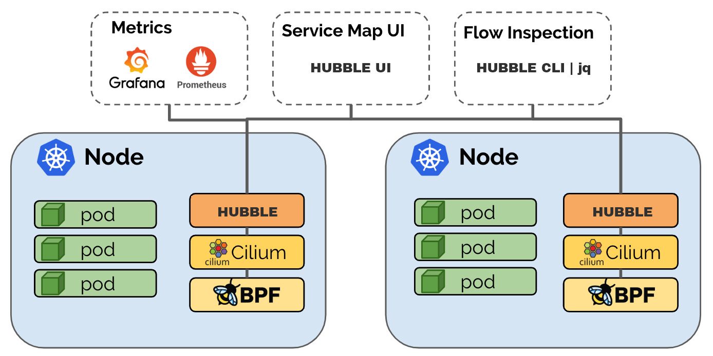

# What is Hubble?

Hubble is a fully distributed networking and security observability platform
for cloud native workloads. It is built on top of [Cilium] and [eBPF] to enable
deep visibility into the communication and behavior of services as well as the
networking infrastructure in a completely transparent manner.

Hubble can answer questions such as:

**Service dependencies & communication map:**
 * What services are communicating with each other? How frequently? How does
   the service dependency graph look like?
 * What HTTP calls are being made? What Kafka topics does a service consume
   from or produce to?

**Operational monitoring & alerting:**
 * Is any network communication failing? Why is communication failing? Is it
   DNS? Is it an application or network problem? Is the communication broken on
   layer 4 (TCP) or layer 7 (HTTP)?
 * Which services have experienced a DNS resolution problems in the last 5
   minutes? Which services have experienced an interrupted TCP connection
   recently or have seen connections timing out? What is the rate of unanswered
   TCP SYN requests?

**Application monitoring:**
 * What is the rate of 5xx or 4xx HTTP response codes for a particular service
   or across all clusters?
 * What is the 95th and 99th percentile latency between HTTP requests and
   responses in my cluster? Which services are performing the worst? What is
   the latency between two services?

**Security observability:**
 * Which services had connections blocked due to network policy? What services
   have been accessed from outside the cluster? Which services have resolved a
   particular DNS name?

# Why Hubble?

The Linux kernel technology [eBPF] is enabling visibility into systems and
applications at a granularity and efficiency that was not possible before. It
does so in a completely transparent way, without requiring the application to
change or for the application to hide information. By building on top of
[Cilium], Hubble can leverage [eBPF] for visibility. By relying on [eBPF], all
visibility is programmable and allows for a dynamic approach that minimizes
overhead while providing deep and detailed visibility where required. Hubble
has been created and specifically designed to make best use of these new [eBPF]
powers.

# Hubble Architecture

Hubble is a distributed platform and thus deployed on each worker node. It runs
side by side to Cilium accesses the monitoring API of Cilium

In return, Hubble exposes metrics as well as flow query API. The following
components make up Hubble:

## Hubble Agent

The Hubble agent is what runs on each worker node. It interacts with the Cilium
agent running on the same node and serves the flow query API as well as the
metrics.

## Hubble Storage

Hubble's storage layer consists of a in-memory storage able to store a fixed
number of flows per node. The intent of the storage layer is to provide a brief
history of flows for troubleshooting purposes.

## Hubble CLI

The Hubble CLI connects to the flow query API of a Hubble agent running on a
particular node and allows to query the flows stored in the in-memory storage
using server-side filtering.

## Hubble UI

The Hubble UI uses the flow query API to provide a graphical service
communication map based on the observed flows. The service map is able to show
service dependencies and visualize network and API calls on layer 3-7.

[Cilium]: https://github.com/cilium/cilium
[eBPF]: http://docs.cilium.io/en/stable/bpf/
