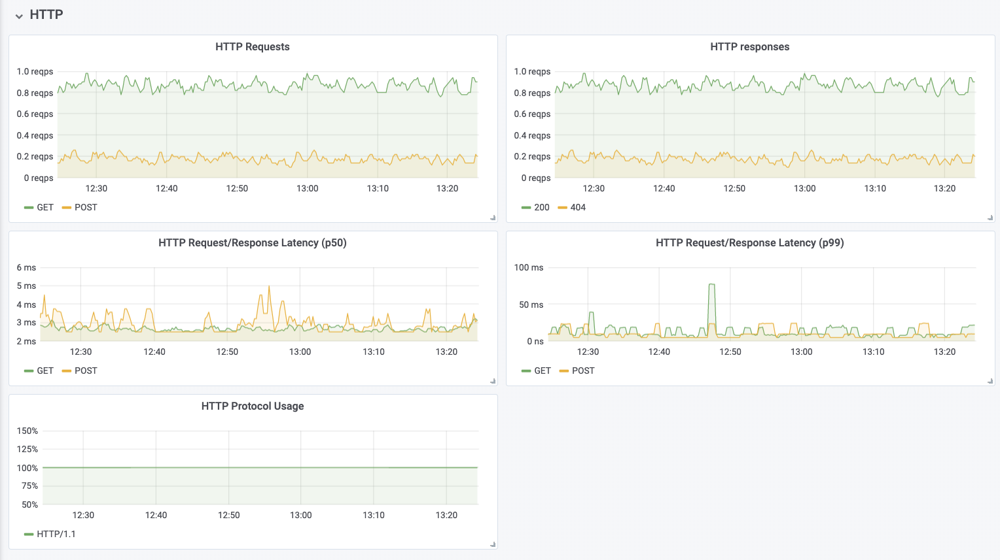

# Metrics

Hubble provides extensive metrics to monitor network & applications behavior
with respect to connectivity and security.

## Installation

While following the [installation instructions](installation.md), enable
metrics with the `--set metrics.enabled`:

    helm template hubble \
        --namespace kube-system \
        --set metrics.enabled="{dns:query;ignoreAAAA,drop,tcp,flow,port-distribution,icmp,http}" \
        > hubble.yaml
    kubectl apply -f hubble.yaml

## Metric Options

### Common Options

#### Source & Destination Context

Most metrics can be configured to source and/or destination context as a label.
The options are called `sourceContext` and `destinationContext`. The possible
values are:

| Option Value  | Description                         |
|---------------|-------------------------------------|
| identity      | All Cilium security identity labels |
| namespace     | Namespace name                      |
| pod           | Pod name                            |

### DNS

| Option Key | Option Value  | Description                         |
|------------|---------------|-------------------------------------|
| query      | N/A           | Include the query as label "query"  |
| ignoreAAAA | N/A           | Ignore any AAAA requests/responses  |

## Example Grafana Dashboard

The following is an example dashboard. The corresponding [JSON definition].

### General Processing

### Networking

### DNS

### HTTP

### Network Policy

[JSON definition]: ../tutorials/deploy-hubble-and-grafana/grafana.json
