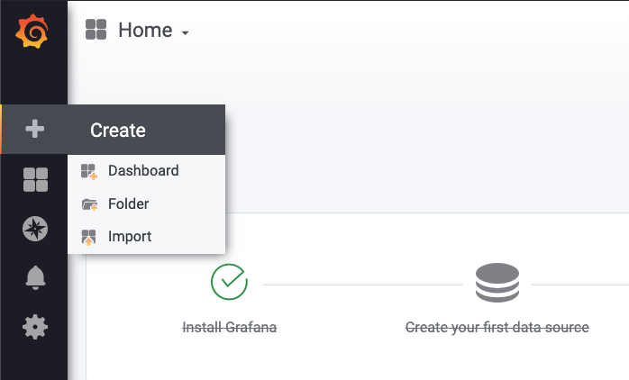
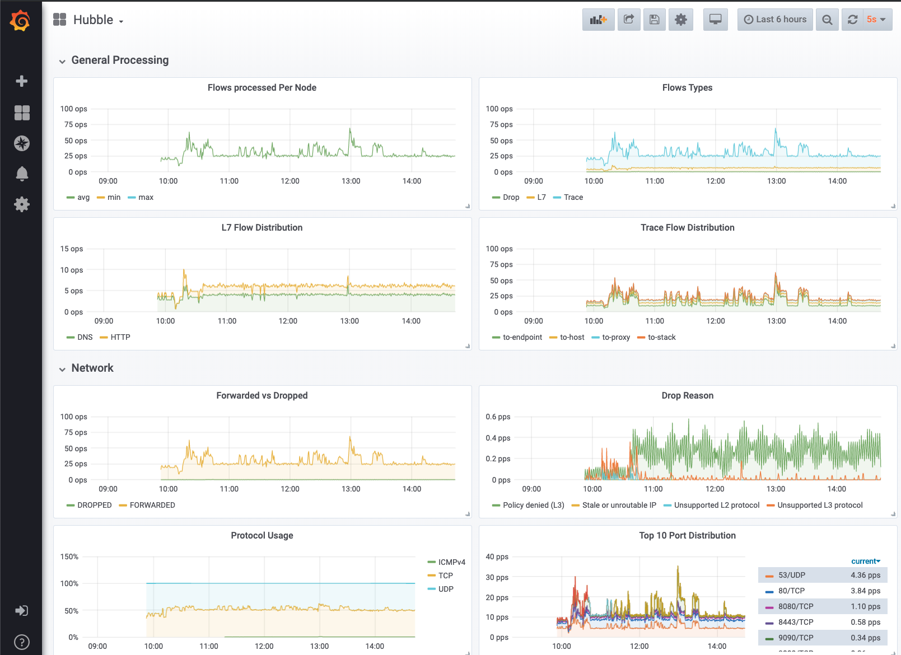

# Setting up Hubble Metrics with Grafana

This tutorial explains how to set up Hubble on Kubernetes with metrics ingested
into Prometheus and displayed via Grafana.

## Install Hubble

Follow the [installation instructions](../../Documentation/installation.md)
to install Hubble and enable all relevant metrics plugins that you will need.
The following metrics configuration example will work well with the example
dashboard provided later in this guide:

    cd install/kubernetes
    helm template hubble \
        --namespace kube-system \
        --set metrics.enabled="{dns:query;ignoreAAAA;destinationContext=pod-short,drop:sourceContext=pod;destinationContext=pod,tcp,flow,port-distribution,icmp,http}" \
        > hubble.yaml
    kubectl apply -f hubble.yaml

By using the Helm template, the Hubble DaemonSet is automatically annotated to
expose its metrics API to Prometheus:

      annotations:
        prometheus.io/port: "6943"
        prometheus.io/scrape: "true"

## Deploy Prometheus & Grafana Stack

Set up Prometheus and Grafana. If you already have a stack running, you can
reuse that stack. Otherwise you can deploy a Prometheus and Grafana stack into
the `cilium-monitoring` namespace using the following command:

    kubectl apply -f https://raw.githubusercontent.com/cilium/cilium/v1.7.0-rc1/examples/kubernetes/addons/prometheus/monitoring-example.yaml

## Deploy the Example Application (Optional)

In order to generate some data, the following example apps can be used. Upon
deployment, the apps will automatically generate some network traffic. The
example also includes minimal network policies and configures HTTP and DNS
visibility.

    cd tutorials/deploy-hubble-and-grafana
    kubectl create namespace starwars
    kubectl apply -f example-apps

## Access the Grafana Dashboard

1. Create a port forwarding rule to access the Grafana Dashboard in your Kubernetes cluster:

        kubectl -n cilium-monitoring port-forward service/grafana 3000:3000

2. Point your browser to `localhost:3000`

3. Import the Hubble dashboard `tutorials/deploy-hubble-and-grafana/grafana.json`

   

4. Open the "Hubble" dashboard

   
