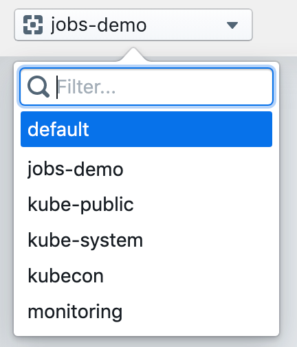
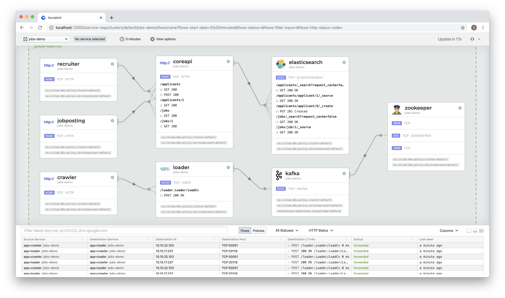

# Getting Started Using Minikube

This guide uses Minikube to demonstrate deployment and operation of Hubble Service Map in a single-node Kubernetes cluster.

> The Minikube VM requires approximately 5GB of RAM and supports hypervisors like VirtualBox that run on Linux, macOS, and Windows.


## Install kubectl & Minikube

1. Install `kubectl` version >= v1.10.0 as described in the [Kubernetes Docs](https://kubernetes.io/docs/tasks/tools/install-kubectl/).
2. Install `Minikube` >= v1.3.1 as per Minikube documentation: [Install Minikube](https://kubernetes.io/docs/tasks/tools/install-minikube/).

> Note: It is important to validate that you have Minikube v1.3.1 installed. Older versions of Minikube are shipping a kernel configuration that is not compatible with requirements of Cilium >= 1.6.0. Run `minikube version` to check the Minikube version.

3. Create a Minikube cluster

```
minikube start --network-plugin=cni --memory=4096
```

## Install Cilium and Hubble

Install Cilium and Hubble as [DaemonSets](https://kubernetes.io/docs/concepts/workloads/controllers/daemonset/) into your new Kubernetes cluster:

```
kubectl create -f https://raw.githubusercontent.com/cilium/cilium/v1.7.0-rc1/install/kubernetes/quick-install.yaml

kubectl create -f https://raw.githubusercontent.com/cilium/hubble/master/tutorials/deploy-hubble-servicemap/hubble-all-minikube.yaml
```


validate that all cilium and hubble pods are up and running:

```
kubectl get pods -n kube-system
NAME                               READY   STATUS    RESTARTS   AGE
cilium-operator-5b69dbb896-7clg9   1/1     Running   0          7m49s
cilium-xxlpc                       1/1     Running   0          7m49s
coredns-5644d7b6d9-jfvdm           1/1     Running   0          31m
coredns-5644d7b6d9-p9gnf           1/1     Running   0          31m
etcd-minikube                      1/1     Running   0          30m
hubble-j6h8p                       1/1     Running   0          7m34s
hubble-ui-6d949d964f-8hgfz         1/1     Running   0          7m34s
kube-addon-manager-minikube        1/1     Running   0          31m
kube-apiserver-minikube            1/1     Running   0          30m
kube-controller-manager-minikube   1/1     Running   0          30m
kube-proxy-87bt8                   1/1     Running   0          31m
kube-scheduler-minikube            1/1     Running   0          30m
storage-provisioner                1/1     Running   0          31m
```

> Note: Hubble pods will not start, if they are not able to find cilium in kube-system or cilium namespaces. 

### Demo Application

Going forward this guide will be using a demo application to show full capabilities of Hubble UI, however you can apply the same techniques to observe application connectivity dependencies in your own namespace, and clusters for application of any type.

The following set of commands installs a jobs board demo app into jobs-demo namespace and generates a sample traffic:

```
kubectl create namespace jobs-demo
kubectl -n jobs-demo apply -f https://app.isovalent.com/demos/jobs.yaml
```

Validate that all pods are up and running:

```
kubectl get pods -n jobs-demo          
NAME                            READY   STATUS    RESTARTS   AGE
coreapi-57466fd965-qshdx        1/1     Running   1          2m3s
crawler-67cf8bbcdd-pq9d5        1/1     Running   0          2m2s
elasticsearch-dbf4fc4df-nxl2x   1/1     Running   0          2m3s
jobposting-57bd4c8596-psqz8     1/1     Running   0          2m3s
kafka-0                         1/1     Running   0          2m3s
loader-69fb98c8b5-qw9h2         1/1     Running   0          2m2s
recruiter-54f94f7b87-78nbt      1/1     Running   0          2m3s
zookeeper-66b5f99f97-542pw      1/1     Running   0          2m3s
```

Generate demo app traffic:

```
curl -sLO https://app.isovalent.com/demos/jobs-traffic.sh && bash jobs-traffic.sh jobs-demo
```


### Accessing User Interface

By default the Hubble UI is deployed without ingress service, in order to access UI you can use the following port-forward command:


```
export NAMESPACE=kube-system
export POD_NAME=$(kubectl get pods --namespace $NAMESPACE -l "k8s-app=hubble-ui" -o jsonpath="{.items[0].metadata.name}")
kubectl --namespace $NAMESPACE port-forward $POD_NAME 12000
```

> Note: Port forwarding only works if you run kubectl on your local machine. If you run kubectl on a master node or inside of a container, you need to defer to creating a NodePort or an Ingress service.

Open http://localhost:12000 in your browser, you should see a screen with an invitation to select a namespace, use the namespace selector dropdown on the left top corner to select a namespace:

.

Once namespace is selected you should see a service map:




