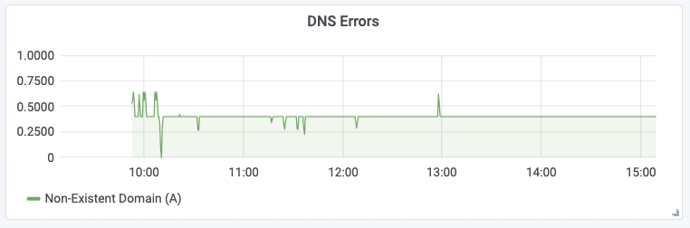
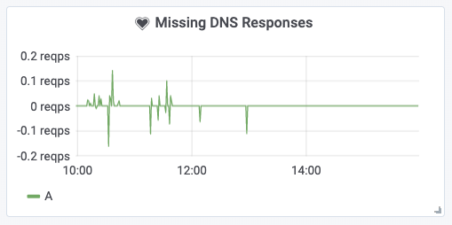

# How to troubleshoot DNS resolution problems

This tutorial provides a step by step guide on how to troubleshoot DNS
resolution problems using Hubble. This tutorial assumes that Hubble is
installed and the dashboard is configured. Please follow the [installation
tutorial](../deploy-hubble-and-grafana/) if you have not done already.

## Check the "DNS Errors" graph

Check the "DNS Errors" graph in the dashboard. It may indicate that DNS errors
are occurring:

The above example shows a constant stream of failing DNS resolutions, about 0.4
failures per second. Let's dig in to see which services and pods are affected.

## Identify pods with failing DNS resolution

Extract all DNS responses which have failed with a `Non-Existent Domain` return
code in the last 5 minutes and generate a sorted list of pod names which have
been affected:

    hubble observe --since=1m -t l7 -j | jq 'select(.l7.dns.rcode==3) | .destination.namespace + "/" + .destination.pod_name' | uniq -c | sort -r
      42 "starwars/jar-jar-binks-6f5847c97c-qmggv"

Show the DNS resolution history of pod `starwars/jar-jar-binks-6f5847c97c-qmggv`

    hubble observe --since=10s -t l7 --pod starwars/jar-jar-binks-6f5847c97c-qmggv --protocol DNS

    Nov 15 14:38:29.450   kube-system/coredns-5c98db65d4-twwdg:0      starwars/jar-jar-binks-6f5847c97c-qmggv:0   dns-response   FORWARDED   DNS Answer RCode: Non-Existent Domain TTL: 4294967295 (Query unknown-galaxy. A)
    Nov 15 14:38:29.447   kube-system/coredns-5c98db65d4-twwdg:0      starwars/jar-jar-binks-6f5847c97c-qmggv:0   dns-response   FORWARDED   DNS Answer RCode: Not Implemented TTL: 4294967295 (Query unknown-galaxy. AAAA)
    Nov 15 14:38:29.446   starwars/jar-jar-binks-6f5847c97c-qmggv:0   kube-system/coredns-5c98db65d4-twwdg:0      dns-request    FORWARDED   DNS Query unknown-galaxy. A
    Nov 15 14:38:29.445   starwars/jar-jar-binks-6f5847c97c-qmggv:0   kube-system/coredns-5c98db65d4-twwdg:0      dns-request    FORWARDED   DNS Query unknown-galaxy. AAAA
    Nov 15 14:38:29.444   kube-system/coredns-5c98db65d4-f4m8n:0      starwars/jar-jar-binks-6f5847c97c-qmggv:0   dns-response   FORWARDED   DNS Answer RCode: Non-Existent Domain TTL: 4294967295 (Query unknown-galaxy.cluster.local. AAAA)
    Nov 15 14:38:29.444   kube-system/coredns-5c98db65d4-f4m8n:0      starwars/jar-jar-binks-6f5847c97c-qmggv:0   dns-response   FORWARDED   DNS Answer RCode: Non-Existent Domain TTL: 4294967295 (Query unknown-galaxy.cluster.local. A)
    Nov 15 14:38:29.444   starwars/jar-jar-binks-6f5847c97c-qmggv:0   kube-system/coredns-5c98db65d4-f4m8n:0      dns-request    FORWARDED   DNS Query unknown-galaxy.cluster.local. A
    Nov 15 14:38:29.443   starwars/jar-jar-binks-6f5847c97c-qmggv:0   kube-system/coredns-5c98db65d4-f4m8n:0      dns-request    FORWARDED   DNS Query unknown-galaxy.cluster.local. AAAA
    Nov 15 14:38:29.442   kube-system/coredns-5c98db65d4-f4m8n:0      starwars/jar-jar-binks-6f5847c97c-qmggv:0   dns-response   FORWARDED   DNS Answer RCode: Non-Existent Domain TTL: 4294967295 (Query unknown-galaxy.svc.cluster.local. AAAA)
    Nov 15 14:38:29.442   kube-system/coredns-5c98db65d4-f4m8n:0      starwars/jar-jar-binks-6f5847c97c-qmggv:0   dns-response   FORWARDED   DNS Answer RCode: Non-Existent Domain TTL: 4294967295 (Query unknown-galaxy.svc.cluster.local. A)
    Nov 15 14:38:29.441   starwars/jar-jar-binks-6f5847c97c-qmggv:0   kube-system/coredns-5c98db65d4-f4m8n:0      dns-request    FORWARDED   DNS Query unknown-galaxy.svc.cluster.local. A
    Nov 15 14:38:29.440   starwars/jar-jar-binks-6f5847c97c-qmggv:0   kube-system/coredns-5c98db65d4-f4m8n:0      dns-request    FORWARDED   DNS Query unknown-galaxy.svc.cluster.local. AAAA
    Nov 15 14:38:29.440   kube-system/coredns-5c98db65d4-twwdg:0      starwars/jar-jar-binks-6f5847c97c-qmggv:0   dns-response   FORWARDED   DNS Answer RCode: Non-Existent Domain TTL: 4294967295 (Query unknown-galaxy.starwars.svc.cluster.local. A)
    Nov 15 14:38:29.439   starwars/jar-jar-binks-6f5847c97c-qmggv:0   kube-system/coredns-5c98db65d4-twwdg:0      dns-request    FORWARDED   DNS Query unknown-galaxy.starwars.svc.cluster.local. A
    Nov 15 14:38:29.439   kube-system/coredns-5c98db65d4-twwdg:0      starwars/jar-jar-binks-6f5847c97c-qmggv:0   dns-response   FORWARDED   DNS Answer RCode: Non-Existent Domain TTL: 4294967295 (Query unknown-galaxy.starwars.svc.cluster.local. AAAA)
    Nov 15 14:38:29.435   starwars/jar-jar-binks-6f5847c97c-qmggv:0   kube-system/coredns-5c98db65d4-twwdg:0      dns-request    FORWARDED   DNS Query unknown-galaxy.starwars.svc.cluster.local. AAAA

## Check for missing DNS responses

A possible explanation for DNS resolution not working is if the DNS responses
are never delivered back to the client. The "Missing DNS Responses" graph can
give a first indication of this being a problem:

## Investigate DNS resolution on UDP level

Assuming that pod `starwars/jar-jar-binks-6f5847c97c-qmggv` is struggling with
DNS resolution. It is possible to specifically check for drops from and to that pod to see

    hubble observe --since=5m --pod starwars/jar-jar-binks-6f5847c97c-qmggv -t drop

In similar fashion, the entire UDP communication can be extracted as well:

    hubble observe --since=5m --pod starwars/jar-jar-binks-6f5847c97c-qmggv -t trace -t drop --port 53
    TIMESTAMP             SOURCE                                          DESTINATION                                       TYPE          VERDICT     SUMMARY
    Nov 15 15:04:19.461   starwars/jar-jar-binks-6f5847c97c-qmggv:47328   kube-system/coredns-5c98db65d4-f4m8n:53(domain)   to-proxy      FORWARDED   UDP
    Nov 15 15:04:19.461   starwars/jar-jar-binks-6f5847c97c-qmggv:47328   kube-system/coredns-5c98db65d4-f4m8n:53(domain)   to-proxy      FORWARDED   UDP
    Nov 15 15:04:19.458   10.96.0.10:53(domain)                           starwars/jar-jar-binks-6f5847c97c-qmggv:52080     to-endpoint   FORWARDED   UDP
    Nov 15 15:04:19.458   10.96.0.10:53(domain)                           starwars/jar-jar-binks-6f5847c97c-qmggv:52080     to-endpoint   FORWARDED   UDP
    Nov 15 15:04:19.457   starwars/jar-jar-binks-6f5847c97c-qmggv:52080   kube-system/coredns-5c98db65d4-f4m8n:53(domain)   to-proxy      FORWARDED   UDP
    Nov 15 15:04:19.457   starwars/jar-jar-binks-6f5847c97c-qmggv:52080   kube-system/coredns-5c98db65d4-f4m8n:53(domain)   to-proxy      FORWARDED   UDP
    Nov 15 15:04:19.456   10.96.0.10:53(domain)                           starwars/jar-jar-binks-6f5847c97c-qmggv:43452     to-endpoint   FORWARDED   UDP
    Nov 15 15:04:19.456   10.96.0.10:53(domain)                           starwars/jar-jar-binks-6f5847c97c-qmggv:43452     to-endpoint   FORWARDED   UDP
    Nov 15 15:04:19.455   starwars/jar-jar-binks-6f5847c97c-qmggv:43452   kube-system/coredns-5c98db65d4-twwdg:53(domain)   to-proxy      FORWARDED   UDP
    Nov 15 15:04:19.455   starwars/jar-jar-binks-6f5847c97c-qmggv:43452   kube-system/coredns-5c98db65d4-twwdg:53(domain)   to-proxy      FORWARDED   UDP

Show all communication from/to CoreDNS:

    hubble observe --since=5m --pod kube-system/coredns -t trace -t drop -t l7
    TIMESTAMP             SOURCE                                            DESTINATION                                       TYPE           VERDICT     SUMMARY
    Nov 15 17:34:42.415   starwars/vader-5f7dbc4975-2ql8b:60879             kube-system/coredns-5c98db65d4-f4m8n:53(domain)   to-proxy       FORWARDED   UDP
    Nov 15 17:34:42.414   starwars/vader-5f7dbc4975-2ql8b:0                 kube-system/coredns-5c98db65d4-f4m8n:0            dns-request    FORWARDED   DNS Query deathstar.starwars.svc.cluster.local. A
    Nov 15 17:34:42.415   10.15.201.245:44718                               kube-system/coredns-5c98db65d4-f4m8n:53(domain)   to-endpoint    FORWARDED   UDP
    Nov 15 17:34:42.429   kube-system/coredns-5c98db65d4-f4m8n:53(domain)   10.15.201.245:44718                               to-host        FORWARDED   UDP
    Nov 15 17:34:42.428   kube-system/coredns-5c98db65d4-f4m8n:0            starwars/vader-5f7dbc4975-2ql8b:0                 dns-response   FORWARDED   DNS Answer "10.110.126.213" TTL: 5 (Query deathstar.starwars.svc.cluster.local. A)

## Count successful and unsuccessful queries

Count all successful DNS queries in the last 10 minutes

    hubble observe --since=10m -t l7 -j \
      | jq 'select(.l7.type=="RESPONSE") | .l7.dns | select(.rcode==null and .query != null) | .query' \
      | sort | uniq -c | sort -r
     735 "deathstar.starwars.svc.cluster.local."

Count the number of unsuccessful DNS queries by query name and return code:

    hubble observe --since=10m -t l7 -j \
      | jq 'select(.l7.type=="RESPONSE") | .l7.dns | select(.rcode!=null and .query != null) | .query + " " + (.rcode|tostring)' \
      | sort | uniq -c | sort -r
     120 "unknown-galaxy.svc.cluster.local. 3"
     120 "unknown-galaxy.starwars.svc.cluster.local. 3"
     120 "unknown-galaxy.cluster.local. 3"
      60 "unknown-galaxy. 4"
      60 "unknown-galaxy. 3"
